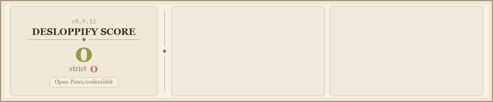

<!-- tech_stack: YAML, GitHub Actions, Semgrep, pre-commit -->
<!-- project_status: active -->
<!-- difficulty: beginner -->
<!-- skill_tags: configuration, code-review, ci-cd, advocacy-language -->
<!-- related_repos: no-animal-violence, semgrep-rules-no-animal-violence, desloppify, platform, gary -->

# Open Paws — CodeRabbit Config

[](https://github.com/Open-Paws/coderabbit)
[](LICENSE)
[](https://github.com/Open-Paws)
[](https://github.com/Open-Paws/no-animal-violence)
[](scorecard.png)

## TL;DR

This repo holds the org-wide [CodeRabbit](https://coderabbit.ai) configuration for every repository in the Open Paws GitHub organization. A single `.coderabbit.yaml` here applies automatically to any repo that does not define its own. It enforces compassionate language rules, secret scanning, test quality standards, and movement-correct terminology on every pull request across the ecosystem.

> [!NOTE]
> Open Paws is a 501(c)(3) nonprofit building open-source infrastructure for animal liberation. CodeRabbit runs at the org level so that advocacy-domain standards — farmed animal terminology, three-adversary security, and mutation-tested quality gates — are consistent across all campaigns, investigation tooling, platform code, and agent infrastructure without needing to configure each repo individually.

---

## Config overview

### File inventory

| File | Purpose |
|---|---|
| `.coderabbit.yaml` | Org-wide CodeRabbit defaults |
| `semgrep-no-animal-violence.yaml` | Imports the full [no-animal-violence rule set](https://github.com/Open-Paws/semgrep-rules-no-animal-violence) for Semgrep |
| `.pre-commit-config.yaml` | Pre-commit hook: runs no-animal-violence check locally |
| `.github/workflows/auto-merge.yml` | Wave 0 auto-merge gate (deployable to target repos) |
| `.github/workflows/no-animal-violence.yml` | CI check for speciesist language on every PR |

### Review behavior

- **Profile:** assertive — flags actionable issues without verbosity
- `request_changes_workflow: true` — CodeRabbit can block merges; required for the Wave 0 auto-merge gate
- High-level PR summary enabled; effort estimation enabled; decorative poem disabled
- Auto-incremental reviews on each push; draft PRs skipped
- Skips reviews for PRs titled `WIP` or `DO NOT MERGE`
- Ignores `dependabot[bot]` and `renovate[bot]` commits

### Automatic labeling

CodeRabbit suggests (does not auto-apply) two labels:

| Label | Trigger |
|---|---|
| `security` | Changes touching authentication, secrets, or coalition/activist data |
| `breaking-change` | Removals or alterations of public API contracts, endpoints, or schemas |

### Path filters (excluded from review)

- `dist/**`, `node_modules/**`
- `**/*.lock`, `**/*.generated.*`
- `.claude/worktrees/**`

### Path-specific review instructions

| Path pattern | What CodeRabbit checks |
|---|---|
| `**/*.test.{ts,js,py}` | Three-question test quality: would it fail on breakage? does it encode a domain rule? would mutation testing kill it? Rejects snapshot traps, coverage theater, and happy-path-only tests. |
| `.claude/**` | Scans for hidden Unicode (Rules File Backdoor attack). Flags hooks that expand scope. Confirms no activist identities or investigation names are embedded in instruction files. |

### Pre-merge checks (hard errors)

Two custom checks run as **errors** and block merge:

1. **No hardcoded secrets** — fails if any non-test file contains API keys, tokens, passwords, database URLs, or service account credentials
2. **No speciesist idioms** — fails if code, comments, variable names, or docs contain terms from the no-animal-violence pattern list

PR title format is checked as a **warning** (imperative verb, under 70 characters).

### Compassionate language enforced

| Avoid | Use instead |
|---|---|
| `livestock` | `farmed animals` |
| `master` / `slave` | `primary` / `replica` |
| `whitelist` / `blacklist` | `allowlist` / `denylist` |
| `cattle vs. pets` | `ephemeral vs. persistent` |
| `kill two birds with one stone` | `accomplish two things at once` |
| `guinea pig` | `test subject` |
| `farm` (industry euphemism) | `factory farm` |

Full pattern list: [Open-Paws/no-animal-violence](https://github.com/Open-Paws/no-animal-violence)

### Static analysis tools

| Tool | Purpose |
|---|---|
| Semgrep | Runs `semgrep-no-animal-violence.yaml` — the full Open Paws [no-animal-violence rule set](https://github.com/Open-Paws/semgrep-rules-no-animal-violence) |
| TruffleHog | Secret scanning on every PR |
| GitHub Checks | CI status integration (90 s timeout) |
| LanguageTool | Default-level prose linting |

### Knowledge base

- Reads `CLAUDE.md` and `AGENTS.md` files in each repo as code guidelines
- Learnings, issues, and PRs are scoped **locally** per repo — no cross-repo leakage
- Web search disabled
- Jira, Linear, and MCP integrations disabled (MCP re-enable pending Gary MCP hub activation)

### CI workflows

**`auto-merge.yml` — Wave 0 auto-merge gate**

Merges `level-0` PRs automatically when all five gates pass:

1. PR is labeled `level-0`
2. All required CI checks pass
3. Desloppify score meets the repo threshold (Gary ≥80, platform ≥75, all others ≥70)
4. No-animal-violence scan has zero errors
5. A validation agent (`gary`, `validation-agent`, or `stuckvgn`) has left an APPROVE review

Auto-merge is never triggered when changes touch `.env`, secret, credential, or key files, or when changes modify `.github/workflows/` files, or when the PR carries a `level-1`, `level-2`, `level-3`, or `needs-human-review` label.

**`no-animal-violence.yml` — speciesist language CI check**

Runs `Open-Paws/no-animal-violence-action@v1` on every PR. Errors block the PR; warnings do not.

---

## How to apply

### Org-wide default (no action needed)

Any Open Paws repo without its own `.coderabbit.yaml` inherits this config automatically. No setup required.

### Extend rather than replace

To merge a repo-level config on top of this one, add `inheritance: true` as the first line of the repo's `.coderabbit.yaml`:

```yaml
# .coderabbit.yaml (repo root)
inheritance: true   # keep all org defaults; settings below are additive overrides
```

### Opt out knowledge base for sensitive repos

Repos handling investigation data, witness information, or coalition ops should disable the knowledge base so that sensitive content does not train models:

```yaml
# .coderabbit.yaml (repo root)
inheritance: true

knowledge_base:
  opt_out: true
```

### Tier reference

| Tier | Examples | Recommended override |
|---|---|---|
| Tier 1 (public, no sensitive data) | platform, desloppify | Use org config as-is |
| Tier 2 (coalition or campaign data) | campaign tooling | `knowledge_base.opt_out: true` |
| Tier 3 (investigation data, witness info, legal) | investigation ops | `knowledge_base.opt_out: true` |

Tier assignments: `ecosystem/repos.md` in the [context repo](https://github.com/Open-Paws/context).

### Deploy CI workflows to a target repo

Copy `.github/workflows/auto-merge.yml` and `.github/workflows/no-animal-violence.yml` from this repo into the target repo's `.github/workflows/` directory. No other changes are needed — the workflows reference org-level actions and secrets.

### Add the pre-commit hook

To run speciesist-language checks locally before pushing, add the hook to the target repo:

```yaml
# .pre-commit-config.yaml
repos:
  - repo: https://github.com/Open-Paws/no-animal-violence-pre-commit
    rev: v1.0.0
    hooks:
      - id: no-animal-violence
        files: \.(py|ts|js|md|yaml|yml)$
```

---

## Code Quality



## Contributing

Changes to `.coderabbit.yaml` affect every Open Paws repo that inherits this config — treat them as high-impact changes.

1. Create a feature branch from `main`
2. Edit `.coderabbit.yaml` and validate against the schema declared at the top of the file (`yaml-language-server: $schema=https://coderabbit.ai/integrations/schema.v2.json`)
3. Open a PR with a description of what changes and why — include the repos most affected
4. After merge, CodeRabbit picks up the new config within minutes; no deployment step is required

The canonical design document for this config lives in the [context repo](https://github.com/Open-Paws/context) at `open-paws-strategy/roadmap/coderabbit-central-config.yaml`.

---

## License

MIT — see [LICENSE](LICENSE) for details.

## Acknowledgments

- [CodeRabbit](https://coderabbit.ai) — AI code review platform
- [Open-Paws/no-animal-violence](https://github.com/Open-Paws/no-animal-violence) — canonical speciesist language pattern list (65+ patterns)
- [Open-Paws/semgrep-rules-no-animal-violence](https://github.com/Open-Paws/semgrep-rules-no-animal-violence) — Semgrep rule set
- [Open-Paws/desloppify](https://github.com/Open-Paws/desloppify) — code quality scanner with advocacy language and security checks

---

[Donate](https://openpaws.ai/donate) · [Discord](https://discord.gg/openpaws) · [openpaws.ai](https://openpaws.ai) · [Volunteer](https://openpaws.ai/volunteer)
